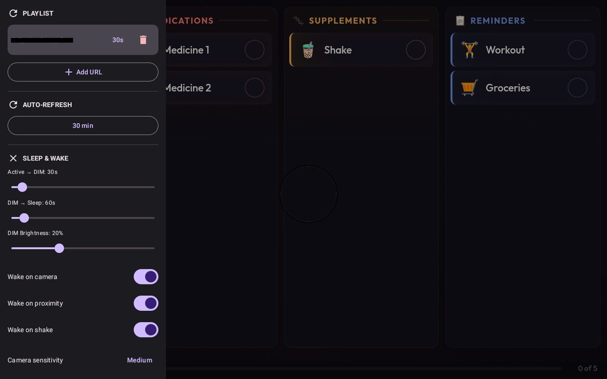
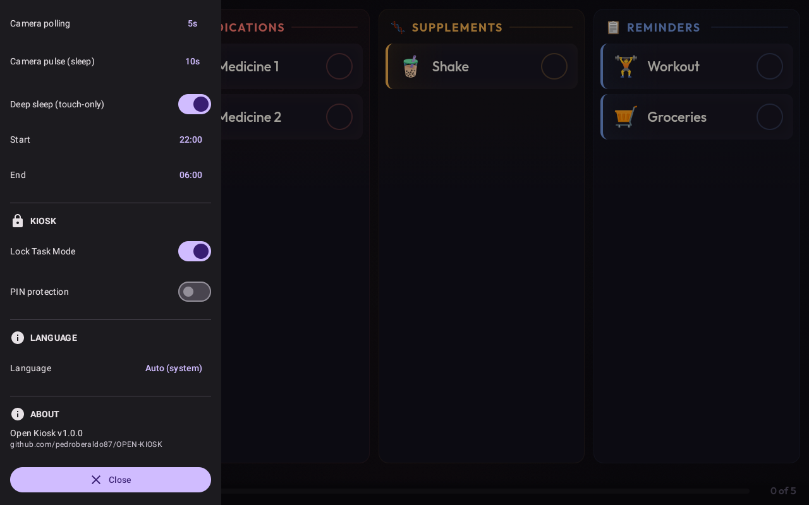
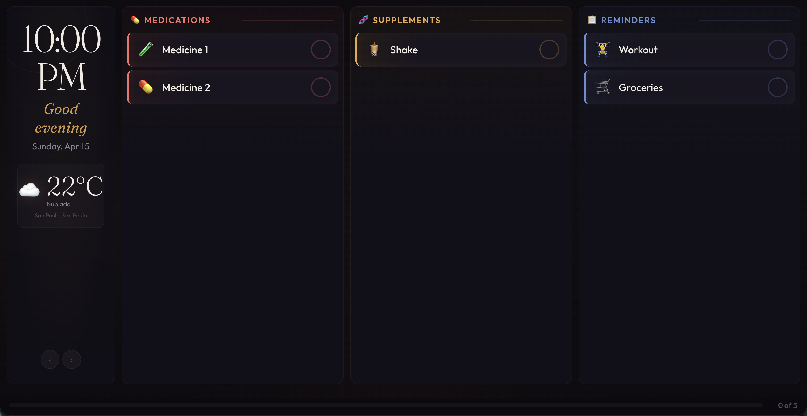
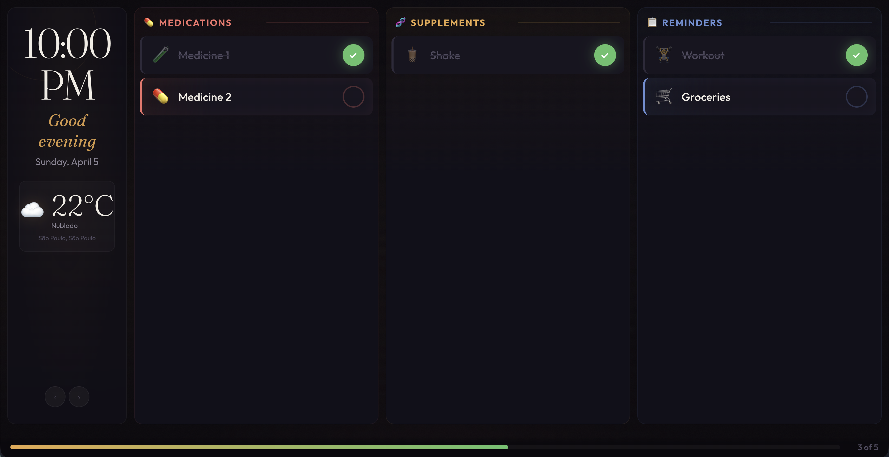

# OPEN-KIOSK

[](LICENSE)
[](https://github.com/pedroberaldo87/OPEN-KIOSK/actions/workflows/build.yml)
[](https://developer.android.com/about/versions/pie)

Open-source Android kiosk browser for digital signage. A lightweight alternative to Fully Kiosk Browser.

## Screenshots

<p>
  
  
</p>

## Recommended Content

Looking for something to display on your kiosk? Check out **[Daily Screen](https://github.com/pedroberaldo87/daily-screen)** — a wall-mounted daily assistant designed for tablets. Displays a daily checklist of medications, supplements, and reminders with progress tracking, weather forecast, and offline support. Built specifically for the same hardware (Fire HD 8, 1280×800 landscape).

<p>
  
  
  
</p>

## Features

- **URL Playlist** — Configure multiple URLs with individual rotation timers
- **Kiosk Lock Mode** — Lock Task Mode (device owner) or immersive sticky fallback
- **Smart Sleep/Wake** — 4-state system (ACTIVE → DIM → SLEEP, plus a scheduled DEEP_SLEEP) with configurable timeouts. Simulates screen-off via brightness control + black overlay — the app never actually turns the screen off, keeping sensors alive. Screen state is persisted, so a relaunch comes back dark if the panel was asleep
- **Camera Motion Detection** — CameraX-based presence detection using Y-plane grayscale frame comparison, with **global light-shift compensation**: the median frame-to-frame delta is subtracted before counting changed pixels, so the panel dimming (or a room light switching) is not mistaken for a person. Frames captured while auto-exposure is still converging are discarded
- **Power-aware camera duty cycle** — on mains power the camera analyses continuously (no blind gap); on battery it pulses, honouring the interval you pick
- **Watchdog service** — a foreground service holds the process (`START_STICKY`) and brings the activity back when something covers it, backing off from 5s up to 60s instead of reposting identically. Relaunch only lights the panel when the stored state says the screen was visible
- **Shake Wake** — Accelerometer-based wake trigger with debounce
- **Auto-Recovery** — WebView crash recovery with proper `destroy()` of the replaced instance, auto-refresh with configurable interval, exponential backoff on errors, connectivity monitoring with offline screen
- **Local Settings** — Swipe-to-reveal drawer with optional PIN protection (disabled by default)
- **HTTP Support** — Cleartext traffic allowed for internal network digital signage

## Tested Hardware

- Amazon Fire HD 8 (`KFRAPWI`, FireOS on Android 11 base), wall-mounted and mains-powered

Verified on that device: the full ACTIVE→DIM→SLEEP cycle with no false wake as the panel dims,
the mains/battery switch changing the camera duty cycle, the watchdog restoring the app after
another app covered it, and a real movement event waking the screen. Device owner is *not*
available there — see the cable provisioning section below.

## Requirements

- Android 9+ (API 28)
- Front-facing camera (optional, for motion detection)

## Quick Start

### Build

Requires a JDK 17+. On macOS the one bundled with Android Studio works without installing anything
else:

```bash
export JAVA_HOME="/Applications/Android Studio.app/Contents/jbr/Contents/Home"
```

```bash
# Gate: compile, unit tests and lint must all pass
./gradlew compileDebugKotlin testDebugUnitTest lintDebug

# Debug APK (~56MB)
./gradlew assembleDebug

# Release APK (~2.4MB, requires signing config)
./gradlew assembleRelease
```

### Install

```bash
adb install app/build/outputs/apk/debug/app-debug.apk
```

### Release Signing

Create a `local.properties` file in the project root:

```properties
signing.storeFile=../keystore/your-keystore.jks
signing.storePassword=your-password
signing.keyAlias=your-alias
signing.keyPassword=your-key-password
```

Generate a keystore:

```bash
keytool -genkeypair -v -keystore keystore/open-kiosk.jks \
  -keyalg RSA -keysize 2048 -validity 10000 -alias openkiosk
```

## Device Owner Setup (Full Kiosk Lock)

For complete kiosk lockdown (blocks home, recents, status bar):

```bash
adb shell dpm set-device-owner com.openkiosk/.receiver.KioskDeviceAdminReceiver
```

**Note:** Device must have no accounts configured (factory reset or fresh setup).

To remove device owner:

```bash
adb shell dpm remove-active-admin com.openkiosk/.receiver.KioskDeviceAdminReceiver
```

Without device owner, the app uses immersive sticky mode (less restrictive but works without special setup).

### If device owner is refused (retail Amazon Fire)

On a retail Fire tablet the command above fails with `Trying to set the device owner, but the user
already has a profile owner` — Amazon's Parental Controls already holds that slot, and the device
also ships with accounts configured. Short of a factory reset, device owner is not available.

These four commands over the cable get you most of the way, and they are what makes the watchdog
actually able to relaunch the app:

```bash
# screen never sleeps while powered (AC | USB | wireless)
adb shell settings put global stay_on_while_plugged_in 7

# no lock screen (this is what shows the ads on a Fire)
adb shell locksettings set-disabled true

# the kiosk becomes the launcher, so HOME returns to it
adb shell cmd package set-home-activity com.openkiosk/.presentation.MainActivity

# REQUIRED: without this, Android blocks the watchdog's background activity start
adb shell appops set com.openkiosk SYSTEM_ALERT_WINDOW allow

# grant the camera up front — an unattended panel has nobody to tap a permission dialog
adb shell pm grant com.openkiosk android.permission.CAMERA
```

These settings live in the device, not in the APK: reinstalling the app keeps them, but a factory
reset or a new tablet needs them applied again.

Note that `com.amazon.kindle.kso` (Special Offers) is a protected package — `pm disable-user` is
refused by the system, so the ads can only be defeated by the lock-screen switch above.

## Configuration

Swipe from the left edge to open the settings drawer. PIN protection is disabled by default — enable it in Kiosk settings.

### Settings Sections

**Auto-refresh**
- Interval: Disabled, 5, 10, 15, 30 or 60 min. "Disabled" really stops the clock, including one
  that was already armed when you changed it

**Sleep & Wake**
- Active → DIM timeout (10-300s, default: 30s)
- DIM → Sleep timeout (5-120s, default: 60s)
- DIM brightness level (5-50%, default: 20%)

**Sensors**
- Camera motion detection toggle + sensitivity (LOW/MEDIUM/HIGH)
- Camera pulse interval, used on battery only: 5, 10, 15, 20, 30 or 60s
- Shake detection toggle
- Proximity wake toggle — note that many tablets, including the Fire HD 8, have no proximity sensor; the app logs it and carries on

**Playlist**
- Add/remove URLs with individual rotation timers
- Duration per item (5-300s)

**Kiosk**
- Lock Task Mode toggle
- PIN protection toggle (disabled by default)
- PIN change (default: 0000)

### How Sleep/Wake Works

The app uses a 4-state system inspired by Fully Kiosk Browser:

1. **ACTIVE** — Screen at normal brightness, content displayed. Sensors off
2. **DIM** — Screen brightness reduced (configurable), content still visible. Camera analysing continuously
3. **SLEEP** — Screen brightness at 0 + black overlay. Appears off but the app stays alive
4. **DEEP_SLEEP** — Same look as SLEEP, but entered by a configurable time window (e.g. 22:00–06:00) rather than by timeout. All sensors off; only touch wakes it

The screen never actually turns off at the OS level. This keeps sensors and camera running so they can detect presence and wake the screen instantly.

The state is written to disk on every transition, so a process death followed by a relaunch comes back in the same state instead of flashing a bright panel at 3am. When no activity is attached, the state machine freezes rather than advancing — otherwise it would record a SLEEP that no panel ever displayed, and the watchdog would read that as "do not light up".

### Camera Motion Detection

The front camera captures low-resolution frames (320x240). Each frame's Y-plane (grayscale luminance) is compared with the previous one — but the **median of the per-pixel differences is subtracted first**. A change that hits the whole frame uniformly (the panel dimming, a lamp being switched, auto-exposure drifting) shifts that median, not the shape of the distribution, so it cancels out. What survives is what changed in some *region* of the image — that is, something that moved.

Frames captured right after the camera binds are discarded, because auto-exposure is still converging and the whole frame changes brightness.

Sensitivity thresholds (fraction of pixels that changed, after the light-shift subtraction):
- **HIGH** — 3% of pixels changed (most sensitive)
- **MEDIUM** — 5% of pixels changed (default)
- **LOW** — 8% of pixels changed (least sensitive)

Duty cycle depends on power: **on mains** the analyser runs continuously, so nobody walking past falls into a blind gap; **on battery** it pulses (a 2.5s window every N seconds, N from settings). Note that the camera is never unbound between pulses — only the analyser is detached — so a longer gap saves CPU, not sensor power.

Field calibration: the per-pixel threshold (`PIXEL_THRESHOLD`) is the knob to turn if the panel wakes by itself in the dark (raise it) or misses people in dim light (lower it). To see the raw signal:

```bash
adb logcat -s MotionDetection:D    # prints changeRatio against the active threshold
```

**Note:** Camera motion detection does not work on emulators (virtual camera is static). Test on real hardware.

## Architecture

- **Stack:** Kotlin 2.0 + Jetpack Compose + CameraX + Room + Hilt
- **Min SDK:** 28 (Android 9) — Target SDK: 34
- **Single module** with logical package separation

```
com.openkiosk/
  presentation/    # UI (MainActivity, Compose screens, ViewModels)
  domain/          # Business logic (PlaylistManager, models)
  data/            # Persistence (Room database, repositories)
  sensors/         # CameraX motion detection, accelerometer wake
  sleep/           # Screen state machine (ACTIVE/DIM/SLEEP/DEEP_SLEEP)
  power/           # Mains-vs-battery monitor (drives the camera duty cycle)
  service/         # Foreground watchdog that keeps the kiosk in front
  kiosk/           # Lock Task Mode management
  webview/         # WebView recovery manager
  receiver/        # Boot receiver, device admin receiver
  di/              # Hilt dependency injection modules
```

## Debugging

```bash
# Everything that decides when the screen lights up
adb logcat -s KioskViewModel:D MotionDetection:D SensorWake:D ScreenState:D KioskWatchdog:D PowerState:D
```

Useful lines to look for:

- `changeRatio=0.00042 (limiar=0.0500)` — the camera signal against the active threshold. With a
  still room this should sit far below the threshold; if it does not, raise `PIXEL_THRESHOLD`
- `SLEEP — na tomada: camera continua` / `na bateria: camera pulsada` — which duty cycle is active
- `MainActivity fora do topo — relançando` — the watchdog noticed something covered the kiosk
- `Atividade sem activity anexada — maquina de estado congelada` — a transition was correctly
  refused because no window was attached

## Contributing

See [CONTRIBUTING.md](CONTRIBUTING.md) for how to build, test, and submit changes.

Please report security vulnerabilities privately — see [SECURITY.md](SECURITY.md).

## Code of Conduct

This project follows the [Contributor Covenant](CODE_OF_CONDUCT.md).

## License

This project is licensed under the [GNU General Public License v3.0](LICENSE).
